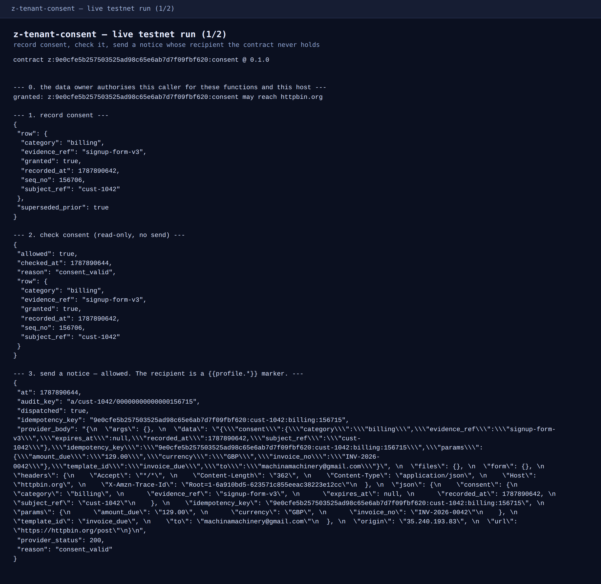

# z-tenant-consent — consent-gated notice dispatch on T3N

**An enterprise agent that can send a customer a notice, and cannot send one
without a recorded consent — while never holding the customer's contact
details.** Built as a T3N TEE contract for the Terminal 3 Agent Build
Challenge, 2026-08-28.

Live on testnet: `z:9e0cfe5b257503525ad98c65e6ab7d7f09fbf620:consent`,
contract id **778**, built from this commit.

**Verify it without an account.** `cargo test` runs the whole decision model on the
native target — 24 tests plus a doc-test, no cluster, no network, no credentials
(re-run green 2026-09-03). Everything that needs Terminal 3 is under
[`ops/`](ops) and is clearly marked; nothing in `src/` requires it.

## The problem

A company wants an AI agent to send transactional notices — an invoice
reminder, a service-outage warning — to its customers. Three things have to be
true at the same time, and normally at least one of them gives:

1. The agent must never learn the customer's email address. Once it is in the
   agent's context, it is in a log, a prompt cache and a model provider.
2. Every send must be provably gated on a recorded, unexpired consent for that
   exact notice category — and it must fail closed, not open.
3. An auditor must be able to read back, later, what was consented and what was
   sent, without trusting the operator's own database.

`z-tenant-consent` gets all three from the platform rather than from discipline:

| Requirement | How it is enforced | Where |
|---|---|---|
| Agent never sees the recipient | The contract templates `{{profile.verified_contacts.email.value}}` into the provider request; the host resolves it inside the enclave | `src/model.rs` → `build_notice_body` |
| No code path can send a plaintext recipient | The `http` host interface is **not imported** — only `http-with-placeholders`. The host refuses to load a contract using a capability it did not import | `wit/world.wit` |
| A caller cannot smuggle a recipient in | Every caller-supplied parameter key *and value* is screened; nesting is refused rather than walked | `src/notice.rs` → `screen_params` |
| The gate fails closed | Absent, withdrawn and expired consent are all refusals, and the refusal path returns **before** any request is built | `src/model.rs` → `decide` |
| Audit survives the operator | Every decision — sent *and* refused — appends a row to the cluster's tamper-evident ledger, keyed by the host's own sequence number | `src/audit.rs` |

## What it does, in one run

Real output, `ops/demo.ts` against testnet — the full transcript is in
[`docs/demo-transcript.txt`](docs/demo-transcript.txt).

```
--- 3. send a notice — allowed. The recipient is a {{profile.*}} marker. ---
{ "dispatched": true, "provider_status": 200, "reason": "consent_valid",
  "audit_key": "a/cust-1042/00000000000000156661", ... }

--- 4. a caller tries to smuggle the recipient in — refused before any host call ---
refused: contract error: bad input: params value under 'note' looks like an
email address; the recipient is resolved host-side from the user profile

--- 6. the same send is now refused — the gate fails closed, nothing leaves ---
{ "dispatched": false, "reason": "consent_withdrawn",
  "audit_key": "a/cust-1042/00000000000000156636" }
```



The provider's echo of step 3 shows `"to": "machinamachinery@gmail.com"` — a
real address, resolved by the host inside the enclave. Grep the contract for
it and you will not find it: what the WASM held was the marker.

## Three parties, three DIDs

`ops/demo.ts` runs the story on one key: the same identity is tenant, data owner
and caller. `ops/three-party.ts` runs it the way the platform means it, with three
distinct DIDs and no shared key — the tenant from `T3N_API_KEY`, a data owner and
an agent from their own secp256k1 keys:

```bash
export T3N_API_KEY="…"          # tenant: owns and deployed the contract
npm run three-party             # generates the other two keys if unset and prints them
```

Recorded run, 2026-09-02, after Terminal 3 funded the two fresh DIDs (full output
in [`docs/three-party-transcript.txt`](docs/three-party-transcript.txt)):

| Step | Called by | Result |
|---|---|---|
| authenticate ×3 | all three | three distinct DIDs, free — no credits needed |
| `agent-auth-update` — the data owner authorises the **agent's** DID on `z:…:consent` | data owner | OK, `tx:121:176670` |
| `record-consent` for the data owner's subject | **agent** | OK, `seq_no 176673` — the consent row the send is later judged against |
| `agent-auth-update` with an empty `agents` list | agent | OK, `tx:121:176678` — clears the agent's own document so the next row measures one thing |
| `send-notice` on the data owner's grant alone | agent | `egress_denied: host 'httpbin.org' is not on the caller's allowed-hosts grant` |
| `agent-auth-update` naming itself, same host | agent | OK, `tx:121:176683` |
| `send-notice` again | agent | egress passes; `placeholder_no_user_context` |
| `send-notice`, self-granted | data owner | `placeholder_no_user_context` |
| `send-notice` | tenant | **dispatched**, provider HTTP 200, audit `a/cust-3001/00000000000000176692` |
| `audit-log` | tenant | 2 rows, `outcome dispatched`, `reason consent_valid` |

Read it as three separate results.

**The separation is real and reachable.** A data owner who has never met the tenant
grants a named agent DID access to named functions on a named contract, the agent
authenticates as itself, and the agent's `record-consent` write lands on the data
owner's grant. Consent is recorded by one identity and enforced against another.

**Egress is authorised by the caller, not by the data owner.** The docs say a
delegated call resolves the *subject user's* allowed hosts; measured, the data
owner's grant naming the agent does not open the host, and the agent granting
itself does. Ruled out separately in `ops/egress-probe.ts`: propagation delay,
and a strict `versionReq` match. Logged as [BUGS.md](BUGS.md) #9.

**Only the tenant's session has a user bound to it,** so `{{profile.*}}` resolves
for the tenant and for nobody else — the agent and the data owner both stop at
`placeholder_no_user_context`, and the data owner is a plain authenticated user
making the documented direct self-call. That is the one wall this design cannot
route around from outside, and it is [BUGS.md](BUGS.md) #10. The contract's own
behaviour is correct throughout: it refuses to dispatch rather than substituting
anything it cannot prove, and every attempt is on the ledger.

**And the delegated call reads a different grant store than the docs teach.**
`ops/delegated-send.ts` writes the same grant on the current surface
(`member-delegation-update`, i.e. `T3nClient.updateMemberDelegation`) and calls with
`pii_did` — the execute wire's "delegated-call target member", which appears in the SDK
types and on no docs page. With the documented `agent-auth-update` grant alone the node
answers `Forbidden (agent_auth_not_found)`; with the current-surface grant,
`delegation.check` returns `authorised:true, disclosed:true` and the call is accepted as
delegated — and still ends at `placeholder_no_user_context`. So the wall in #10 is not an
authorisation problem: [BUGS.md](BUGS.md) #11.

The zero-credit grant in row 2 is not what the docs predict, and is logged as
[BUGS.md](BUGS.md) #7.

## Interface

Five functions, all on the `contracts` interface, all taking the standard
`generic-input` envelope and returning JSON bytes.

| Function | Input | Does |
|---|---|---|
| `record-consent` | `{subject_ref, category, granted?, expires_at?, evidence_ref?}` | Records a grant; archives the row it replaces |
| `withdraw-consent` | `{subject_ref, category, evidence_ref?}` | Records a withdrawal — even when nothing was on record |
| `check-consent` | `{subject_ref, category}` | Read-only decision. Sends nothing, writes nothing |
| `send-notice` | `{subject_ref, category, template_id, params?}` | The gated send |
| `audit-log` | `{subject_ref?, limit?}` | Reads back the decision ledger |

`subject_ref` is an opaque tenant-side customer reference. Passing a contact
detail is rejected — including an address hidden inside prose.

## Storage

Two tenant maps, both private and contract-only:

- `z:<tid>:ledger` — `c/<subject>/<category>` current consent,
  `h/<subject>/<category>/<seq>` superseded rows, `a/<subject>/<seq>` audit
  rows. One map means one ACL to keep correct across redeploys.
- `z:<tid>:secrets` — `provider_url`, optional `provider_api_key` and
  `provider_auth_header`, seeded from the control plane with `map-entry-set`.

The provider is read at call time, not baked into the WASM, so rotating a key
or repointing to a different email provider is a control-plane write — no
rebuild, no re-registration, no new `contract_id`.

## Build and run

Prerequisites: Rust with `wasm32-wasip2`, Node ≥ 20 (the SDK throws
`Crypto API is not available` on Node 18 — [BUGS.md](BUGS.md) #8).

```bash
rustup target add wasm32-wasip2
npm install

cargo test                                        # 24 tests, no network, no cluster
cargo build --target wasm32-wasip2 --release      # → target/wasm32-wasip2/release/z_tenant_consent.wasm

export T3N_API_KEY="…"                            # from the T3N claim page
export PROVIDER_URL="https://httpbin.org/post"    # any transactional-email API
export CONTRACT_VERSION="0.1.0"
npm run deploy                                    # register + create maps + seed config
npm run demo                                      # the seven-step story above
```

`ops/deploy.ts` is idempotent: re-running after a rebuild re-registers at the
same tail and re-points both map ACLs at the new `contract_id`, which is the
one redeploy hazard the platform currently has (see [BUGS.md](BUGS.md) #4).

## Testing

`cargo test` runs 24 tests on the **native** target — no cluster, no network,
no WASM runtime — because every rule worth testing lives in pure functions
(`src/model.rs`) and the host is reached through one shim (`src/host_shim.rs`)
whose native stubs fail loudly. That is what makes the guards testable:

```
expired_consent_is_refused_including_on_the_boundary_second
a_recipient_hidden_under_an_innocent_key_is_refused_too
nested_params_are_refused_rather_than_walked
audit_scan_range_is_half_open_and_subject_scoped
the_body_carries_a_marker_and_never_a_real_recipient
```

Several of these encode a bug found while writing them — the audit scan bound
originally matched a neighbouring subject (`cust-10` inside a `cust-1` scan),
and the recipient screen originally missed an address inside prose.

## Maintenance and handover

Deliberately boring to keep running:

- **No off-cluster state.** Two KV maps, both owned by the tenant. Nothing to
  back up, no database, no queue, no cron.
- **No secrets in the artifact.** The WASM holds no key and no URL.
- **Provider changes are configuration**, not deployments.
- **Redeploy is one command** and re-points the ACLs itself.
- **The failure modes are named.** `no_consent_on_record`,
  `consent_withdrawn`, `consent_expired`, `egress_denied`,
  `placeholder_unknown`, `placeholder_no_user_context` are stable strings that
  appear in both the response and the audit row.

Known limits, stated plainly: `kv-store::scan` is one-shot with no cursor, so
`audit-log` returns at most 500 rows per call and sets `"truncated": true` when
it fills its budget — a caller walking a large ledger narrows the range and
re-calls. And the per-minute fuel quota (BUGS.md #1) caps how fast a batch can
run; this contract makes one outbound call per notice and no retries.

## Bugs found

Six, with reproductions and exact error text, in [BUGS.md](BUGS.md) — including
an undocumented `fuel_per_minute` quota, a docs snippet that does not compile,
and a WIT comment that contradicts the documentation site.

## Licence

MIT.
